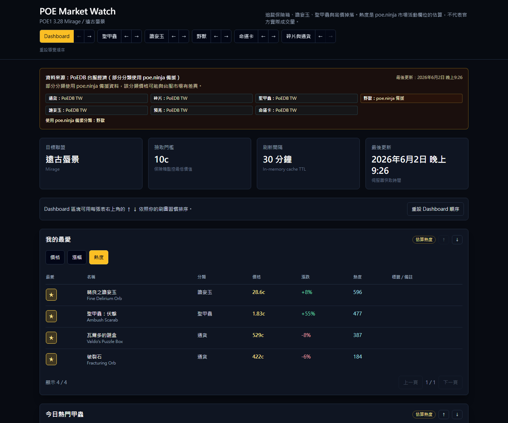
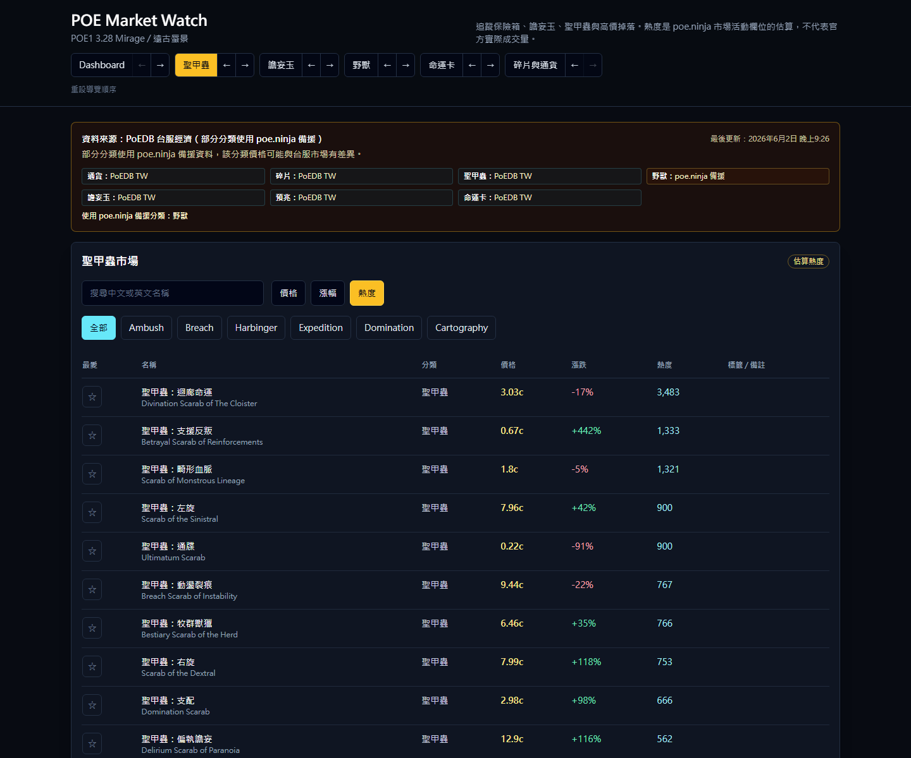
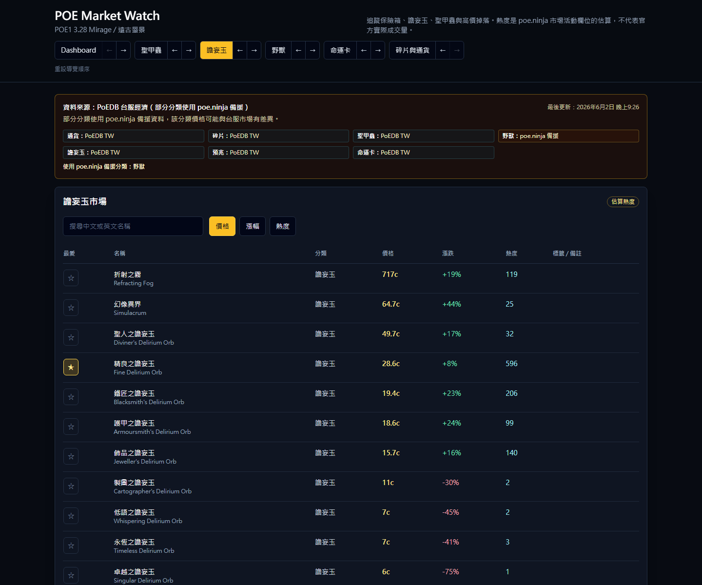
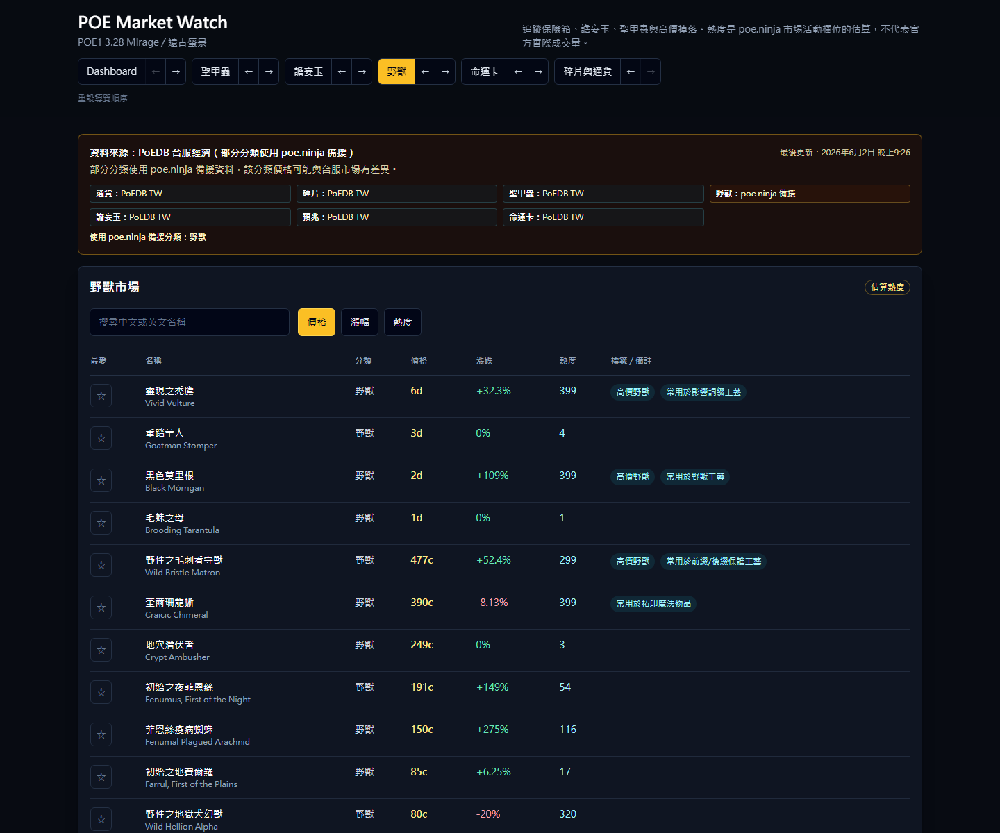
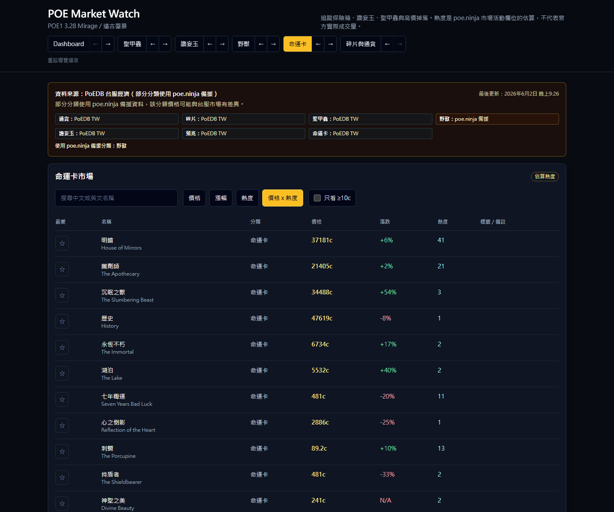

# POE Market Watch

繁體中文 | [English](README.md)

Live Demo：[https://quackowob.github.io/poe-market-watch-tw/](https://quackowob.github.io/poe-market-watch-tw/)

Path of Exile 1 台服 `Mirage` 聯盟（`遠古蜃景`）市場監控 Dashboard。

本專案目前支援兩種使用模式：

- 本機 Docker-first 開發，支援 hot reload。
- GitHub Pages 靜態展示版，在 build 階段產生市場資料。

本機開發不需要安裝 Node.js、npm 或 pnpm，只需要 Docker / Docker Compose。

## 功能

- Dashboard：監控保險箱相關掉落與高價物品。
- 分頁：聖甲蟲、譫妄玉、野獸、命運卡、通貨、碎片。
- 物品名稱優先顯示繁體中文，同時保留英文名稱供搜尋。
- 支援我的最愛、Dashboard 區塊順序與導覽順序偏好設定。
- 市場資料快照輸出到 `public/data/market.json`。
- 資料更新資訊輸出到 `public/data/meta.json`。
- 資料超過 2 小時會在 UI 顯示「資料可能過期」。

## 截圖

### Dashboard



### 聖甲蟲



### 譫妄玉



### 野獸



### 命運卡



## 資料來源

主要資料來源：

- PoEDB TW Economy

備援資料來源：

- poe.ninja，僅在 PoEDB 無法連線、解析失敗或缺少分類時使用。

注意事項：

- 台服市場與國際服市場價格可能明顯不同。
- 價格僅供參考，不保證可用該價格成交。
- 熱度是市場活動估算，不代表官方實際成交量。
- 來源資料中的 `volume`、`count`、`listingCount` 在 UI 中都應顯示為熱度或估算熱度。

## 非官方聲明

POE Market Watch 不是 Grinding Gear Games 官方工具，與 Grinding Gear Games 無關。

Path of Exile、GGG、PoEDB、poe.ninja，以及相關名稱、圖示與資料權利歸原權利人所有。

不要把 `POESESSID`、帳號 cookie、token 或 API key 放進公開 repository。

## Docker 本機開發

建立 `.env`：

```bash
cp .env.example .env
```

啟動本機開發：

```bash
docker compose up --build
```

開啟：

```text
http://localhost:3000
```

dev container 會：

1. 在 Docker 內安裝 dependencies。
2. 產生 `public/data/market.json` 與 `public/data/meta.json`。
3. 啟動支援 hot reload 的 `next dev`。

停止：

```bash
docker compose down
```

清除 Docker volumes：

```bash
docker compose down -v
```

## 靜態正式版預覽

用 Docker 建置並啟動靜態匯出版：

```bash
docker compose -f docker-compose.prod.yml up --build -d
```

開啟：

```text
http://localhost:3000
```

此模式會用 `scripts/serve-static.mjs` 服務 `out/`，不使用 Next.js server runtime。

停止：

```bash
docker compose -f docker-compose.prod.yml down
```

## 市場資料

手動產生市場資料：

```bash
docker compose exec web npm run build:market-data
```

產生市場資料並建立完整靜態匯出：

```bash
docker compose exec web npm run build:pages
```

輸出檔案：

```text
public/data/market.json
public/data/meta.json
```

`meta.json` 包含：

- `updatedAt`
- `source`
- `stale`
- `errorMessage`
- `itemCount`

如果市場資料更新失敗，但已有上一份成功的 `market.json`，系統會保留上一份資料並將 `meta.json` 標記為 stale。

## GitHub Pages 部署

Workflow：

```text
.github/workflows/deploy-pages.yml
```

流程：

1. 依 `package-lock.json` 使用 `npm ci` 安裝 dependencies。
2. 執行 `npm run build:market-data`。
3. 依 GitHub Pages 網址設定 `NEXT_PUBLIC_BASE_PATH`。
4. 執行 `npm run build`。
5. 將 `out/` 上傳到 GitHub Pages。

Repository 設定：

1. 啟用 GitHub Pages。
2. Pages source 設為 GitHub Actions。
3. 確認 Actions 權限允許 Pages deployment。

Workflow 也會每 30 分鐘排程更新一次。

## Static Export 設計

GitHub Pages 沒有 server runtime，因此 UI route 不做 runtime provider fetch。

目前資料流：

```text
build step -> PoEDB / fallback providers -> public/data/*.json -> frontend
```

UI 透過 `lib/marketData.ts` 讀資料，不直接依賴 provider 實作。這樣之後若要讓本機或其他部署模式切回 server provider，仍可保留架構彈性。

不要在使用者瀏覽器端大量直接請求 PoEDB。不要把 GitHub Pages 當高頻 API server。

## 常用 Scripts

```bash
npm run build:market-data
npm run build:pages
npm run build:i18n
npm run update:i18n:beasts
npm run report:i18n
```

本機開發時建議透過 Docker 執行：

```bash
docker compose exec web npm run <script>
```

## 已知限制

- PoEDB 並未針對所有分類提供穩定公開 JSON API，因此部分資料來自 HTML 解析。
- 野獸資料目前可能需要 poe.ninja 備援。
- GitHub Pages 的資料會在排程更新間隔內變舊。
- 尚未實作歷史價格儲存。
- 尚未實作價格警報或 Discord 通知。

## Roadmap

- 公開版截圖
- 更完整的靜態資料快取診斷
- 價格警報
- Discord 通知
- 歷史價格圖表
- 倉庫掃描
- 私有本機 `POESESSID` 整合
- 使用外部儲存保存長期歷史資料

## License

程式碼採 MIT License。請見 `LICENSE`。

PoE、PoEDB、poe.ninja、GGG 名稱、圖示與資料權利歸原權利人所有。若引用或重用 PoEDB wiki content，需遵守 PoEDB 的內容授權條款。
