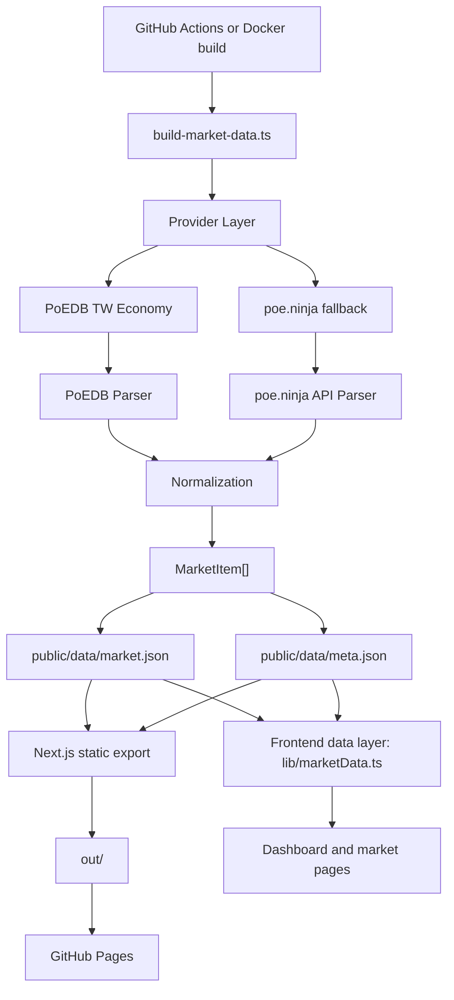

# Architecture

POE Market Watch is built as a static-first Next.js application. Market data is collected during the build process and exported as JSON files under `public/data`.

## Provider Layer

Providers fetch raw market data from external sources and expose a shared interface.

Current providers:

- `PoedbTwProvider`
  - Realm: Taiwan
  - Primary source for public market prices
  - Parses PoEDB TW Economy pages
- `PoeNinjaProvider`
  - Realm: Global
  - Fallback only
  - Used when PoEDB is unavailable, parsing fails, or a category is missing

Provider contract:

```ts
interface MarketDataProvider {
  name: string;
  realm: "TW" | "Global";
  fetchCategory(category: MarketCategory): Promise<MarketItem[]>;
  fetchAll(): Promise<MarketItem[]>;
}
```

## Normalization

Provider-specific data is normalized into `MarketItem`.

Normalization responsibilities:

- Convert provider rows into a stable internal model.
- Attach category metadata.
- Resolve Traditional Chinese item names.
- Preserve English names for search.
- Convert prices to chaos-equivalent values.
- Convert provider activity/count fields into heat or estimated heat.

The UI should not depend on PoEDB HTML structure or poe.ninja payload shape.

## Ranking

Ranking logic lives in `lib/ranking.ts`.

Current ranking responsibilities:

- Top heat items
- Top gainers
- Top losers
- High value items
- Strongbox drop monitoring
- Favorite item filtering

Ranking operates on normalized `MarketItem[]` only.

## Dashboard

The Dashboard is composed from normalized market data.

Primary sections:

- Favorites
- Popular Scarabs
- Delirium Orb Market
- High Value Beasts
- High Value Divination Cards
- Strongbox Drop Monitoring

Client-side preferences control:

- Favorite items
- Dashboard section order
- Navigation order

## Static Export

GitHub Pages does not provide a server runtime. Public deployment therefore uses static export.

Build output:

- `public/data/market.json`
- `public/data/meta.json`
- `out/`

The frontend reads through `lib/marketData.ts`, not directly from providers. This keeps a future path open for local/server deployments to use live providers again.

## Flow


